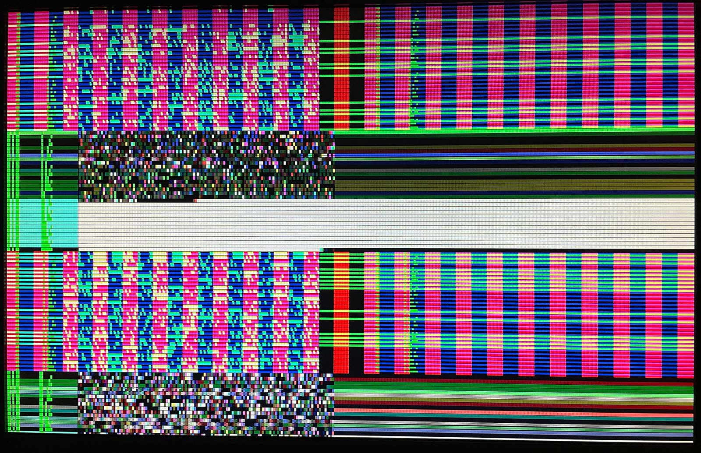

  

# tt05-vga-spi-rom

This is a simple submission for Tiny Tapeout 05 (TT05) which tests reading (and optionally buffering) and displaying data from an attached SPI flash memory (e.g. W25Q80) on a VGA display.

NOTE to self: The original version of this code is from my private repo, [here](https://github.com/algofoogle/sandpit/tree/master/fpga/vga_spi_rom).

This repo also includes [`de0nano`](./de0nano/) which is a Quartus project (tested in Quartus Prime Lite Edition version 22.1.0) to wrap the main TT05 `tt_um_algofoogle_vga_spi_rom` design and test it on a DE0-Nano board. That's how I generated the photo above.

NOTE: If you want to read my ramblings as I worked on this and had other thoughts, see [my journal entry about it (0155)](https://github.com/algofoogle/journal/blob/master/0155-2023-10-09.md) and perhaps trace back through older related entries.

# Testing/simulation stuff

Included in this repo is [`src/spiflash.v`](src/spiflash.v) as taken from [efabless/caravel], specifically [here](https://github.com/efabless/caravel/blob/978fa0802312917957ad7186523d946c8cce3c9f/verilog/dv/caravel/spiflash.v). This file is only used for automated tests/simulation; it is not part of the synthesised design. The [original code](https://github.com/YosysHQ/picorv32/blob/f00a88c36eaab478b64ee27d8162e421049bcc66/picosoc/spiflash.v) was written by [Claire Xenia Wolf](https://github.com/clairexen). As far as I can tell, the Caravel version that I've included in this repo adds: the [`FILENAME` parameter](https://github.com/efabless/caravel/blob/main/verilog/dv/caravel/spiflash.v#L41); and [support for Continuous Mode](https://github.com/efabless/caravel/blob/978fa0802312917957ad7186523d946c8cce3c9f/verilog/dv/caravel/spiflash.v#L290-L324).

NOTE: `spiflash` doesn't work with a raw binary file. It expects a hex file compatible with `$readmemh()`. One is included: `src/test_rom.hex` (and its original binary `src/test_rom.bin` extracted from an ESP-01 module).

Tests are written with cocotb. The [`test` GitHub Action](.github/workflows/test.yaml) runs them. You can check that out to see how it sets up an environment and runs the tests. Here's the short version, though:
1.  Make sure you have a Python 3.6+ environment.
2.  Run `pip install -r requirements.txt`
3.  Install iverilog (I'm using 12.0)
4.  Optional: Install GTKWave
5.  Go into the `src/` dir then run `make` -- this will run the tests, and produce `src/tb.vcd`
6.  Optional: View the VCD file with: `make show`

# What is Tiny Tapeout?

TinyTapeout is an educational project that aims to make it easier and cheaper than ever to get your digital designs manufactured on a real chip.

To learn more and get started, visit https://tinytapeout.com.

The GitHub action will automatically build the ASIC files using [OpenLane](https://www.zerotoasiccourse.com/terminology/openlane/).

## Resources

- [FAQ](https://tinytapeout.com/faq/)
- [Digital design lessons](https://tinytapeout.com/digital_design/)
- [Learn how semiconductors work](https://tinytapeout.com/siliwiz/)
- [Join the community](https://discord.gg/rPK2nSjxy8)

[efabless/caravel]: https://github.com/efabless/caravel/tree/main
